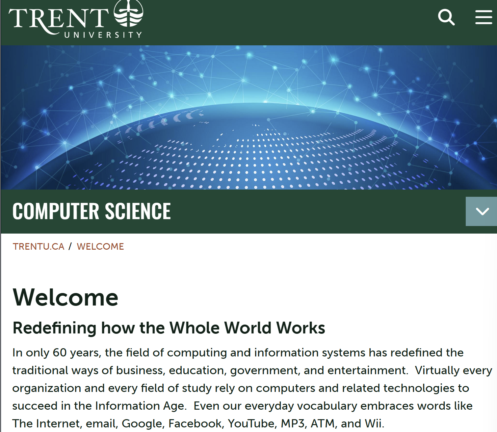

# Workshop 4

## Paragraphs

In only 60 years, the field of computing and information systems has redefined the traditional ways of business, education, government, and entertainment.  Virtually every organization and every field of study rely on computers and related technologies to succeed in the Information Age.  Even our everyday vocabulary embraces words like The Internet, email, Google, Facebook, YouTube, MP3, ATM, and Wii.

The study of computing and information systems is central to our understanding of how the world processes, manages and communicates information using digital technologies.  As a student, you learn to build and use computing and information systems.  You learn to see things from a broader systems perspective and to develop integrated solutions that meet the needs of your users.  And you learn to appreciate the far-reaching cultural, ethical, and legal impact of digital systems.

## Strong and Emphasis

### Strong

In only 60 years, the field of **computing and information systems** has redefined the traditional ways of business, education, government, and entertainment.  Virtually every organization and every field of study rely on computers and related technologies to succeed in the __Information Age__.  Even our everyday vocabulary embraces words like The Internet, email, Google, Facebook, YouTube, MP3, ATM, and Wii.

### Emphasis

The study of 
*computing and information* systems is central to our understanding of how the world processes, manages and communicates information using digital technologies.  As a student, you learn to build and use _computing and information_ systems.  You learn to see things from a broader systems perspective and to develop integrated solutions that meet the needs of your users.  And you learn to appreciate the far-reaching cultural, ethical, and legal impact of digital systems.

## Lists

### Ordered Lists

1. Item one
2. Item two
    1. Sub item one
    2. Sub item two
3. Item three


### Unordered Lists

- Item one
- Item two
    - Sub item one
    - Sub item two
- Item three

## Images



## Hyperlinks

[Trent University Computer Science Page](https://www.trentu.ca/cois/)

## Code

### Inline Code

In HTML we use the `` tag to display images

### Code Fences

#### HTML

```html
<nav>
    <ul>
        <li><a href="index.html">Home</a></li>
        <li><a href="grid.html">Grid</a></li>
        <li><a href="https://trentu.ca">Trent</a></li>
        <li><a href="https://loki.trentu.ca">Loki</a></li>
    </ul>
</nav>
```

#### CSS

```css
header {
  display: flex;
  justify-content: space-between;
  align-items: center;
  padding: 0.5em;
  background-color: #a9c47f;
}
```
